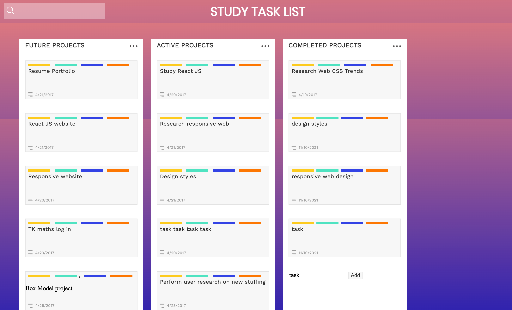

# Board to do items
> Application of CSS Grid- Advance CSS project
A project for IT CSWITCH
 HTML, CSS, JS

## General Information
 A project that applies my knowledge on how to lay out the structure of a grid’s rows and columns and place items within that grid using CSS. 

## Screenshots
